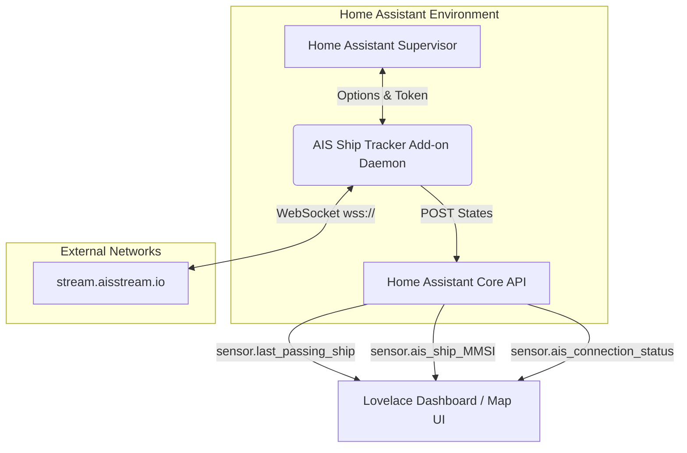
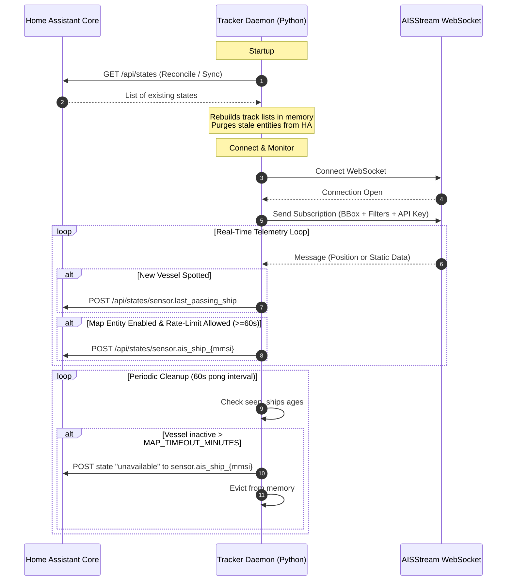

# Architecture Documentation: AIS Ship Tracker Home Assistant Add-on

This document describes the architectural design, components, data flows, and key implementation details of the **AIS Ship Tracker** Home Assistant Add-on.

---

## 1. High-Level Overview

The **AIS Ship Tracker** is a Python-based Home Assistant add-on designed to track marine vessel movements within a user-defined geographical bounding box. It interfaces with the live public WebSocket stream provided by [AISStream.io](https://aisstream.io), processes real-time Automatic Identification System (AIS) messages, and publishes telemetry directly into Home Assistant's State API.

---

## 2. Core Components

The add-on is packaged as a Docker container running a single-threaded Python event-driven daemon:

### 2.1. Configuration Layer (`config.yaml` & Home Assistant Options)
* **Configuration Definition**: Handled by `config.yaml`, specifying standard add-on options (e.g., API key, bounding box corners, and feature toggles like Class B inclusions, map entity timeouts, and developer mode).
* **Ingestion**: The daemon reads configuration details at startup from `/data/options.json` (mounted by the Home Assistant Supervisor).
* **Robust Parsing**: Implements safe parsing (`get_safe_int()`, string-to-bool checks) to prevent failures due to invalid user configurations.

### 2.2. The Tracking Engine (`ais_ship_tracker.py`)
* **State Synchronization on Startup**: Querying the Home Assistant Core API on start allows the daemon to reconcile its memory with existing Home Assistant entities, rebuilding its track lists and purging stale entities without requiring persistent local storage.
* **WebSocket Client**: Uses the `websocket-client` library to maintain a persistent connection to `wss://stream.aisstream.io/v0/stream`.
* **Telemetry Processing Pipeline**:
  1. **Message Interceptor**: Parses incoming JSON frames and checks for stream error payloads.
  2. **Decoder**: Decodes Class A/B position reports and static ship data messages.
  3. **Memory Trackers**: Keeps track of `seen_ships` (timestamps), `last_map_update` (rate-limiting tracker), and `static_ship_data` (destination, dimensions, ETA, call sign, vessel type).
  4. **Purging Subsystem**: Runs on every WebSocket ping interval (approx. 60s) to clear out stale vessels exceeding the configured time threshold.

### 2.3. Home Assistant API Integration
* Direct HTTP integration with the Supervisor API using Python's native `urllib.request`.
* Creates and updates three types of Home Assistant sensor entities:
  1. `sensor.last_passing_ship` (or `_dev` variant): Details the latest newly spotted vessel in the area.
  2. `sensor.ais_ship_{mmsi}`: Individual dynamic track entities created for map plotting (updated every 60s).
  3. `sensor.ais_connection_status`: Reflects WebSocket connection health and shows sanitized error messages (scrubbing private API keys).

---

## 3. Data Flow and Lifecycle

### 3.1. Reconnection & Backoff Strategy
To safeguard against connection failures and to protect the rate limits of the external service, the main process is wrapped in a reconnection loop with an incremental sleep backoff (`RECONNECT_DELAY` of 10 seconds on top-level loop crashes, and standard reconnection handles inside the websocket lifecycle loop).

---

## 4. Key Design Patterns

### 4.1. Stateless Synchronization
By querying `/api/states` at boot time, the daemon remains entirely stateless. If the add-on container restarts, it identifies which ships were already being tracked on Home Assistant's maps and restores them to memory, preventing visual "flickering" or map resets for the user.

### 4.2. Sensitive Data Scrubbing
Authentication errors from the remote server often echo the query string or subscription details, exposing the user's private API key. The add-on features a string-replacement sanitization step (`str(error).replace(AIS_API_KEY, "[REDACTED]")`) before sending any logs or connection status changes to Home Assistant sensors.

### 4.3. Anti-Spam API Controls
Vessel telemetry can update multiple times a second in busy shipping lanes. Pushing updates to Home Assistant's database at that rate would cause database bloat. The add-on implements two throttle gates:
1. **Startup Event Gate**: `sensor.last_passing_ship` only triggers when a ship transitions from "unseen" to "seen".
2. **Time-Based Gate**: Individual ship map coordinates (`sensor.ais_ship_{mmsi}`) are throttled to a minimum update window of 60 seconds.
